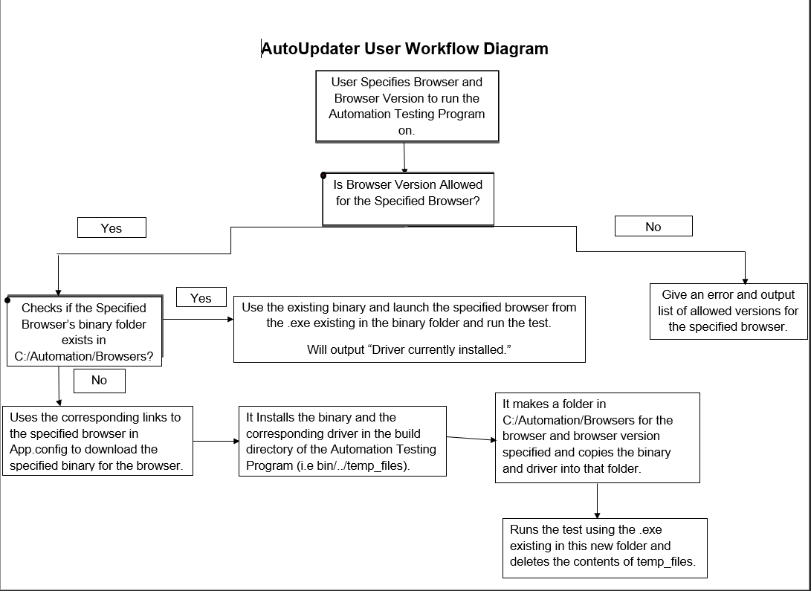
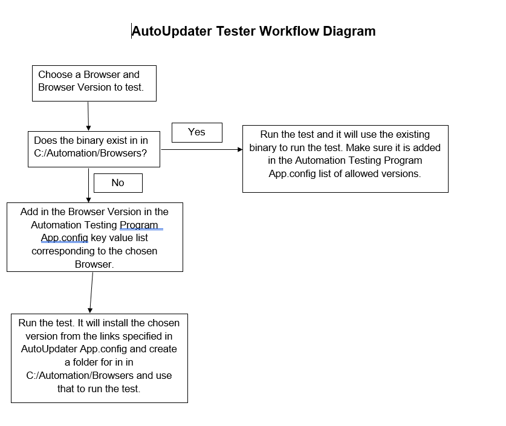

# AutoUpdater

AutoUpdater is an application that enables the user to download any version of a binary and webdriver for Chrome for Testing, Edge (WIP), and FireFox. 

## How to Run
Below are the command line arguments that can be passed in.
```c#
--browser
* Refers to the browser the user wants to use.
* Ex. --browser Chrome

--version
* Refers to the major build version of the browser the user wants to use.
* Ex. --version 126

```
To use AutoUpdater, you must run AutoUpdater first before running  AutomationTestingProgram. This ensures that AutomationTestingProgram can successfully locate the browser webdriver and binary. 
## How it Works

AutoUpdater navigates to a link that provides the webdriver, binary or both. For example:
Chrome for Testing Driver + Binary: https://googlechromelabs.github.io/chrome-for-testing/files
Microsoft Edge Driver: https://msedgedriver.azureedge.net/
FireFox Driver: https://github.com/mozilla/geckodriver/releases/download

When AutoUpdater is ran, it creates the directory C:\Automation\Browsers, where it stores all the browser binaries and drivers. Next, it takes the --browser and --version command argument and checks the whether the aforementioned directory contains a binary in the format {browser}-{version}, so chrome-126 for example. We'll focus on Chrome for now. If chrome-126 does not exist, AutoUpdater would use a JSON endpoint that provides the latest minor build for a major build. The program  would download the endpoint as a JSON file, read its contents, and store the version number into a variable. Now that we have the version number, we substitute that into the URL to access another JSON endpoint that contains the driver and binary for that specific version. That JSON file is downloaded and the program reads through the file until it reaches the appropriate object, win-x64 for example. This contains the URL for the binary of the version we want to use and we download it asynchronously to ensure the program waits for the download to succeed. Now, every file that is downloaded goes into temp_files that will be removed every time the program ends.

Next, the .zip file is extracted to C:\Automation\Browsers. Repeat this process when downloading the driver. The driver is extracted into its corresponding binary directory. This covers the case when --version {MAJOR_BUILD} is passed.

For Firefox it downloads a setup file which is used to install firefox in bin/../temp_files. This is run and the output binary is put into C:/Automaation/Browsers and used to run the test.





[WIP]